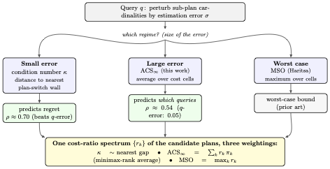
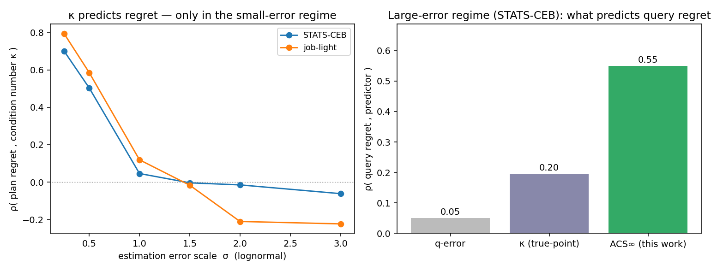
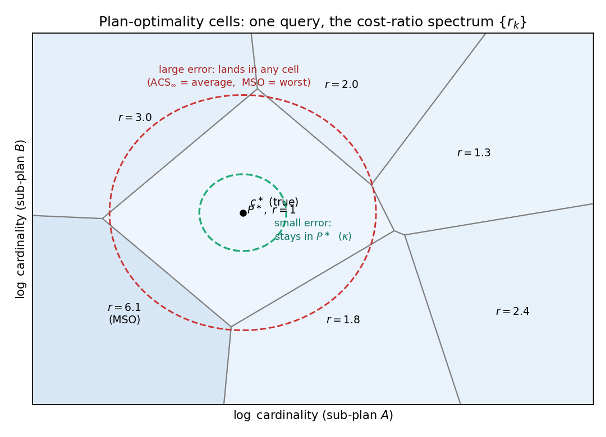
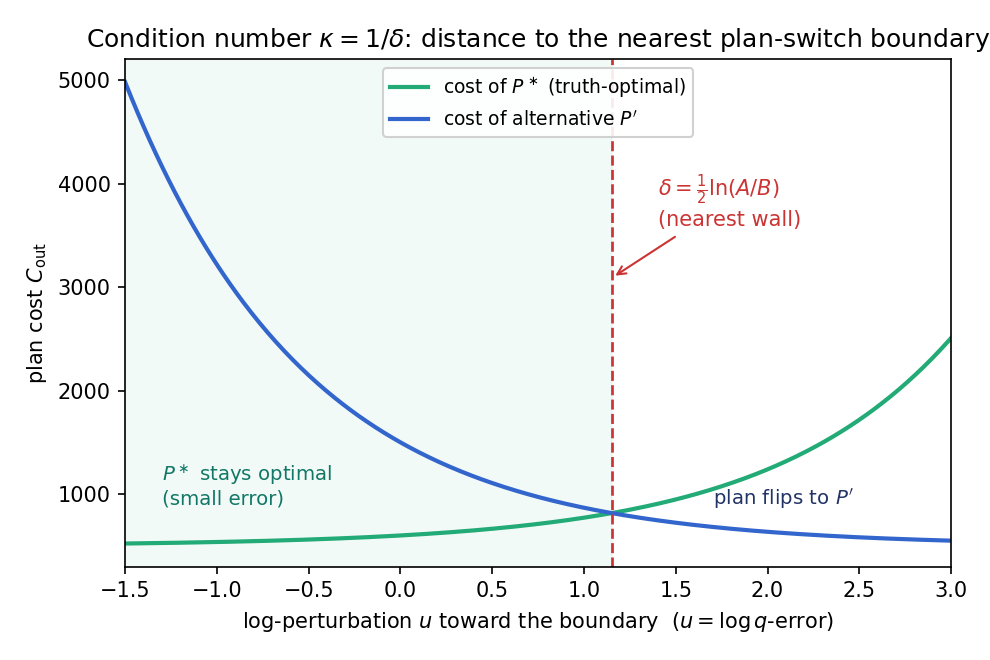

# ce-metric-eval — when does an error metric predict query-plan regret?

A small, reproducible study (and toolkit) on a simple question in cardinality estimation (CE):

> **Cardinality-estimation papers rank estimators by *q-error*. But does a better q-error mean better
> query plans?** Sometimes — and *when* turns out to depend on the error regime, in a way that has a clean
> geometric explanation.

This repo contains the exact join optimizer, the plan-cost-regret (P-error) machinery, three
geometric quantities, the benchmarks, and a fully **pre-registered** experimental trail behind the
findings below. It builds on — and credits — a long line of robust-query-optimization work; see
[Relation to prior work](#relation-to-prior-work). It is an **honest measurement + small theorem**, not a
new SOTA estimator.



*The whole idea in one picture: which plan-cost-geometry quantity predicts plan regret depends on the size
of the estimation error. All three are summaries of the same plan cost-ratio spectrum $\{r_k\}$; q-error is
orthogonal to that geometry.*



*Left: the true-point condition number κ predicts plan regret only for small estimation error, decaying to
~0 as error grows (both benchmarks). Right: in the large-error regime where real estimators operate, ACS∞
predicts which queries suffer regret far better than q-error or κ.*

## TL;DR findings

Plan **regret** (a.k.a. P-error = cost of the plan chosen under estimates ÷ cost of the optimal plan,
both under true cardinalities) is governed by **plan-cost geometry**, and *which* geometric quantity
predicts it depends on how large the estimation errors are. q-error — an estimate-magnitude scalar — is
orthogonal to that geometry and predicts regret poorly at the query level.

One cost-ratio spectrum {rₖ} (the true-cost ratios of a query's candidate plans), **three weightings**:

| regime | predictor of regret | geometric quantity | weighting of {rₖ} |
|--------|---------------------|--------------------|-------------------|
| **small error** (accurate estimators) | condition number **κ** | nearest plan-switch boundary (closed form ½·ln(A/B)) | local, true-point |
| **large error** (inaccurate estimators) | **ACS∞** (this work) | average-case sub-optimality | minimax-rank probabilities πₖ |
| **worst case** (adversarial) | **MSO** (Haritsa, prior) | maximum sub-optimality | max rₖ |

Measured on the standard **STATS-CEB** and **JOB-light** benchmarks with 4 released learned estimators
(+ DuckDB's native estimator), all under **pre-registered** decision rules (`PREREGISTRATION.md`):

- **κ predicts small-error regret** — ρ ≈ 0.7–0.8 at low error, out-predicting realized q-error there,
  and its power **decays to ~0 as error grows** (exactly as forward-error ≈ condition-number × backward-error
  predicts — the relation is local). Independently confirmed on JOB-light.
- **ACS∞ predicts large-error regret** — on STATS-CEB (where real estimators are inaccurate), ACS∞ predicts
  which queries suffer regret at ρ ≈ 0.54, while **q-error manages only ρ ≈ 0.05** at the query level.
  Robust (bootstrap 95% CI of the margin = [0.22, 0.74]), generalizing (held-out query splits + an unseen
  estimator), and regime-specific (it does **not** win in the small-error regime, where κ does).
- **A limit theorem** (`THEORY-3.md`): ACS∞(q) = Σₖ rₖ·πₖ, where rₖ are true cost-ratios and πₖ are
  **cardinality-independent** combinatorial selection probabilities (a minimax over subset ranks). Derived
  from the σ→∞ limit and validated numerically (cardinality-independence corr → 0.994 as σ→30).
- **The reconciliation:** the long-running "q-error vs plan-cost" debate is two **regimes** of one
  phenomenon. Real learned estimators straddle the boundary — which is *why* no single scalar error metric
  predicts their regret cleanly.
- **Validated on real PostgreSQL, not just C_out** (`costmodel/`): injecting each estimator's cardinalities
  into PostgreSQL 13.1 and measuring *actual runtime regret*, ACS∞ predicts which queries get hurt
  (ρ = **0.42**, k=3, 110/111 queries) while q-error does not (−0.16); margin 95% CI **[0.34, 0.82]**. The
  regimes are not an artifact of the simplified cost model.

## What ACS∞ is, intuitively

ACS∞(q) ≈ "the typical badness of a random plan for this query." A query whose candidate plans have a
dispersed cost spectrum is intrinsically regret-prone under poor estimation, *regardless of which
estimator is used*. It is the **average-case** companion to Haritsa's **worst-case** MSO (= the single
worst plan), and unlike q-error it is estimator-independent — a property of the query, not the estimate.

## The geometry, in two pictures

<p align="center"></p>

*Log-cardinality space tiles into **plan-optimality cells** (a plan diagram). Small error keeps the
estimate inside the optimal cell — the **condition number κ** is the distance to the nearest wall. Large
error lands it in any cell: **ACS∞** averages the cost-ratios over cells, **MSO** takes the worst.*

<p align="center"></p>

*The small-error condition number, made concrete: two plans' costs cross at δ = ½·ln(A/B); within δ the
optimal plan survives, beyond it the plan flips. κ = 1/δ. Figures regenerate via
`figures/{flow.tex, concept_cells.py, flip_margin.py, make_figures.py}`.*

## Validated on real PostgreSQL (not just C_out)

A natural objection: C_out is a simplified cost model — do the regimes survive a real optimizer? We
re-measured **regret as actual PostgreSQL 13.1 runtime**, injecting each estimator's join cardinalities and
timing the resulting plan vs. the true-cardinality plan (`costmodel/`).

<p align="center"></p>

ACS∞ — computed purely from C_out geometry, never seeing PostgreSQL — predicts real runtime regret
(ρ = **0.42**, k=3, full coverage 110/111 queries) while q-error does not (−0.16); margin 95% CI
**[0.34, 0.82]**. The headline regrets are genuine plan changes (e.g. 32.6 s vs 1.3 s). So the κ/ACS/MSO
regimes are **not an artifact of the cost model**. We also report a *negative* honestly: a plan-cost (PPC)
arm via `pg_hint_plan` is **infeasible** because the estimators' bad plans are cardinality-induced
near-cartesian orders the hint tool won't reproduce. Details + one-command reproduce: `costmodel/README.md`.

## Reproduce

```bash
pip install -r requirements.txt              # numpy, scipy, duckdb, matplotlib
python -m pytest tests/ -q                    # or: python tests/test_core.py  (7 hand-verified tests)
bash scripts/fetch_data.sh                     # ~50MB benchmark clone
python -m ce_metric_eval.workload 4            # compute STATS-CEB true cardinalities (DuckDB; cached)
python -m ce_metric_eval.confirm               # the κ small-error regime result
python -m ce_metric_eval.step2                 # the ACS large-error result (pre-registered, bootstrapped)
python -m ce_metric_eval.acs_limit             # validate the ACS∞ limit theorem
```

See `REPRODUCIBILITY.md` for the exact environment, data provenance, and known coverage limits
(23/146 STATS-CEB queries are dropped — their join COUNT(\*) exceeds a 4s timeout at up to 10¹⁰ rows;
JOB-light is fully covered).

## Layout

- `ce_metric_eval/optimizer.py` — exact bushy DP join optimizer, C_out cost model, plan enumeration.
- `ce_metric_eval/geometry.py` — P-error (regret) and the condition number **κ** (closed-form flip margin).
- `ce_metric_eval/acs.py`, `acs_limit.py` — **ACS∞** by Monte-Carlo and by the limit law Σ rₖ πₖ.
- `ce_metric_eval/workload.py` — STATS-CEB (DuckDB true cards) + JOB-light (inline) loaders.
- `ce_metric_eval/{experiment,confirm,step2}.py` — the pre-registered analyses.
- `costmodel/` — **real-PostgreSQL** runtime-regret validation (`run_pg.py`, `analyze_pg.py`, `vm_setup.sh`)
  + the infeasible PPC arm (`run_ppc.py`); see `costmodel/README.md`.
- `PREREGISTRATION.md` — the frozen hypotheses + decision rules (incl. one honest **rejected** hypothesis
  and one **near-miss**, kept for the record). `THEORY-3.md` — the limit theorem. `paper/note.md` — the
  short writeup.

## Relation to prior work

This work stands on, and does not claim to originate, the geometry it uses:

- **Plan-optimality regions in selectivity/cardinality space** — *plan diagrams* / POSP, Reddy & Haritsa
  (VLDB 2005) and the plan-diagram-reduction / robust-plan line. The "cells" here are theirs.
- **q-error → plan-suboptimality bound** (and its looseness for large error) — Moerkotte, Neumann, Steidl
  (VLDB 2009).
- **Maximum Sub-Optimality (MSO)** and worst-case robust query processing — Haritsa et al. ACS∞ is the
  average-case companion to MSO.
- **Per-plan robustness via cost integrals over cardinality** — Wolf et al. (VLDB 2018). That is a *per-plan*
  selection aid; ACS∞ is a *per-query* difficulty predictor over the optimizer's plan *choice* — related but
  distinct.
- **P-error / Plan-Cost** as the regret metric — Negi et al. (Flow-Loss, VLDB 2021); the STATS-CEB benchmark
  — Han/Zhu et al. (VLDB 2022). We *use* P-error as ground truth; we do not introduce it.

The contribution here is the **average-case sub-optimality predictor ACS∞**, its **limit theorem**, the
**κ/ACS/MSO regime taxonomy**, and the **pre-registered empirical demonstration** that q-error fails to
predict query-level regret in the large-error regime where ACS∞ succeeds. Modest, but (we believe) new.
Corrections and pointers to prior art we missed are very welcome — please open an issue.

## License

Code: Apache-2.0 (`LICENSE`). The benchmark data is fetched from its own repository under its own license.
