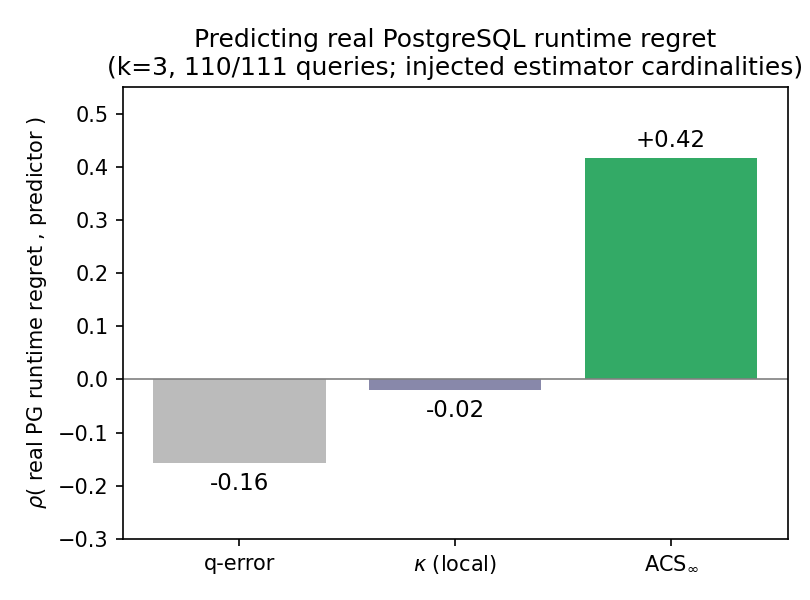

# Real-cost-model validation (PostgreSQL)

Does the C_out-geometry predictor **ACS∞** survive on a *real* optimizer's *real execution time*, or is it
an artifact of the simplified C_out cost model? This directory answers that on **PostgreSQL 13.1**.

## Result

We inject each released estimator's join cardinalities into a patched PostgreSQL (the
[End-to-End-CardEst-Benchmark](https://github.com/Nathaniel-Han/End-to-End-CardEst-Benchmark) build, which
exposes `ml_joinest_enabled`/`ml_joinest_fname`), run the query, and measure **runtime regret** =
runtime(plan chosen under the estimator) / runtime(plan chosen under true cardinalities). We then ask
whether ACS∞ (computed purely from C_out geometry, never seeing PostgreSQL) predicts that regret.

On a dedicated box, **k=3 (median of 3), full coverage (110/111 queries)**:



| predictor | ρ( real PostgreSQL runtime regret ) |
|-----------|-------------------------------------|
| **ACS∞** (C_out geometry) | **+0.42** |
| κ (C_out, local) | −0.02 |
| q-error | −0.16 |

margin(ACS∞ − q-error) bootstrap 95% CI = **[+0.34, +0.82]**. So **ACS∞ predicts which queries suffer real
PostgreSQL runtime regret, and q-error does not** — the regimes are **not** a C_out artifact. The headline
regrets are genuine plan changes (e.g. one query: 32.6 s vs 1.3 s). (Pooled per-(query,estimator), q-error
wins 0.61 vs 0.10 — the same query-level-vs-estimator-level nuance as everywhere else: ACS∞ is a *query*
difficulty measure.)

## A negative we report honestly

A **plan-cost (PPC) arm** — pin each estimator's plan with `pg_hint_plan`, re-cost under true cardinalities
— is **infeasible** here: the estimators' bad plans are *cardinality-induced near-cartesian* join orders
(a cross-product is exactly why they are slow), which `pg_hint_plan` will not reproduce under true
cardinalities. So the noise-free PPC arm is not obtainable; the runtime arm above is the real-cost evidence.

## Reproduce

Needs Docker. On a fresh Ubuntu box, `vm_setup.sh` builds the patched PG image, loads STATS, and starts the
container `ce-pg`; then:

```bash
bash costmodel/vm_setup.sh                                  # build patched PG + load STATS (Docker)
CE_BASE=<repo>/data python -m pytest -q                      # (optional) ensure truth_cache exists first:
#   bash scripts/fetch_data.sh && python -m ce_metric_eval.workload 4
CE_BASE=<repo>/data python costmodel/run_pg.py 0 120 3       # runtime regret, all queries, 120s, median of 3
python costmodel/analyze_pg.py                                # ACS_inf vs q-error vs kappa on real runtime
# costmodel/run_ppc.py + analyze_ppc.py: the PPC arm (documented as infeasible above)
```

Files: `run_pg.py` (driver: per-query slice injection + `EXPLAIN ANALYZE`), `analyze_pg.py` (predictors vs
runtime regret), `run_ppc.py`/`analyze_ppc.py` (the PPC attempt), `vm_setup.sh` (one-shot PG build + load).
